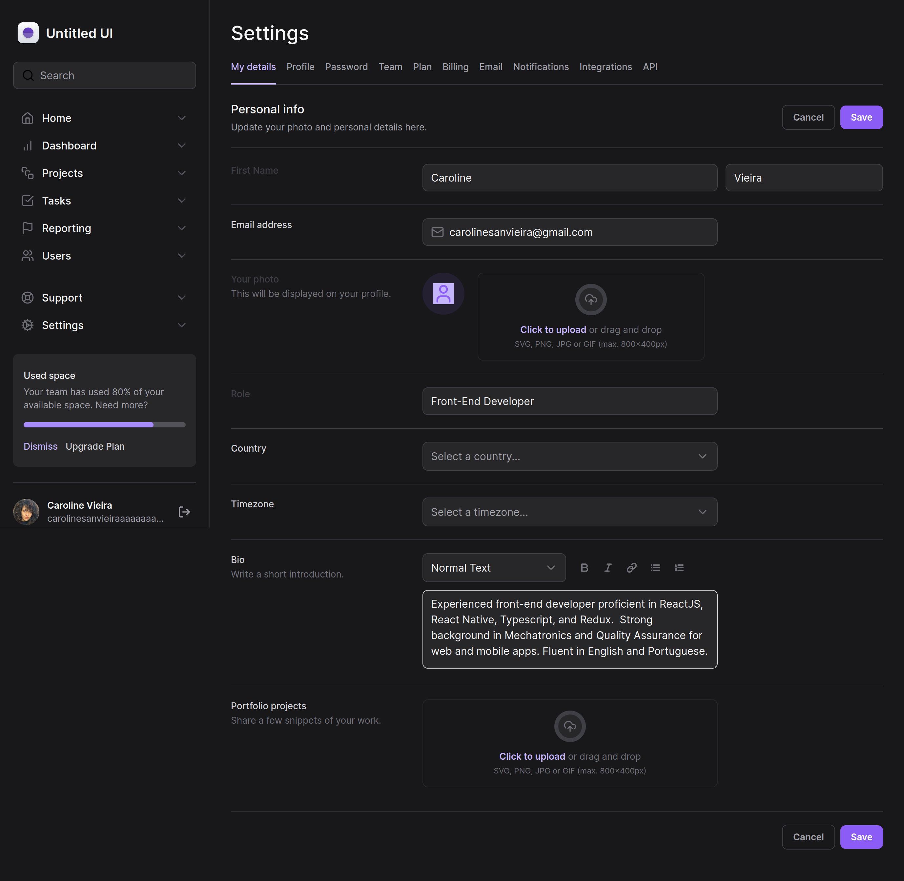
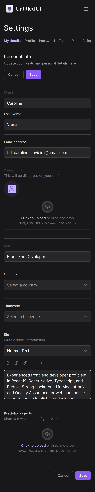
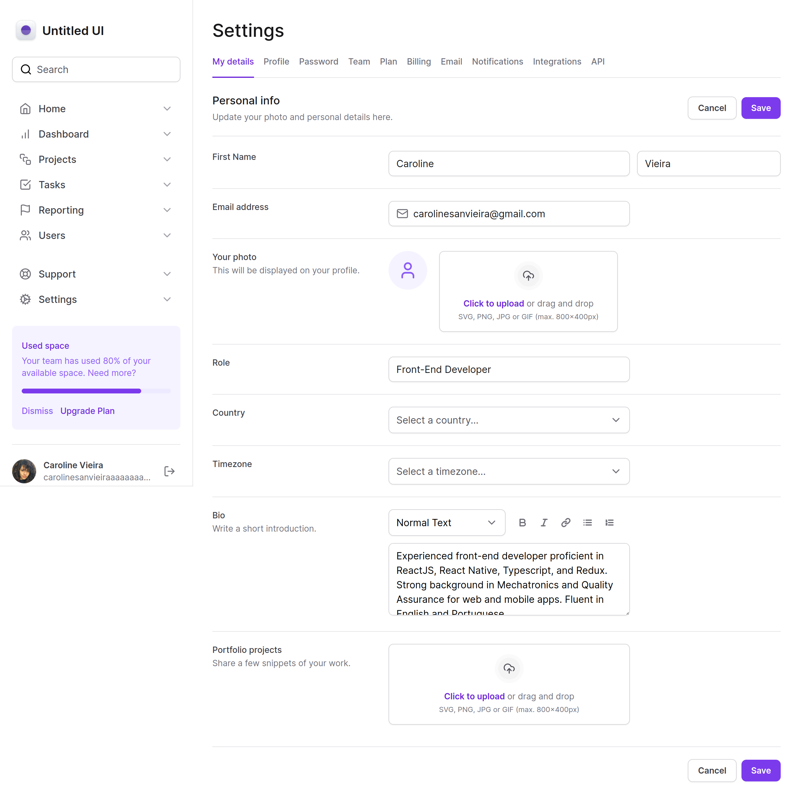
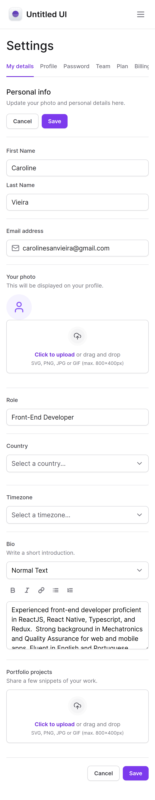

<div style="display: flex; justify-content: center; gap: 4px;">
  
	
</div>
<div style="display: flex; justify-content: center; gap: 4px;">
     
   
</div>  

<br>

<div style="display: flex; justify-content: center;">
  <a href="#memo-project">Project</a>&nbsp;&nbsp;&nbsp;|&nbsp;&nbsp;&nbsp;
  <a href="#rocket-technologies">Technologies</a>&nbsp;&nbsp;&nbsp;|&nbsp;&nbsp;&nbsp;
  <a href="#clipboard-requirements">Requirements</a>&nbsp;&nbsp;&nbsp;|&nbsp;&nbsp;&nbsp;
  <a href="#keyboard-how-to-run-the-project ">How to run the project </a>&nbsp;&nbsp;&nbsp;|&nbsp;&nbsp;&nbsp;
</div>
<br>

---

## :memo: Project 

This course covered Tailwind CSS from its core concepts to advanced techniques, including efficient styling, responsive design, theming, and component creation.

"Mastering Tailwind" 


Tailwind CSS Fundamentals:

**Declarative interface**
- Minimizing class repetition
- Efficient styling with variations
-	Theme First API for design patterns
-	Predefined color palettes
-	Consistent typography and spacing

**Project Setup and Styling:**
-	Integrating Tailwind with Next.js
-	Leveraging pseudo-selectors
-	Styling interactive elements
-	Automating CSS processes
-	Using responsive breakpoints

**Responsive Design:**

-	Mobile First approach
-	Customizing styles for different screens
-	Pre-configured breakpoints

**Themes and Dark Mode:**

-	Light and Dark theme customization
-	Automatic theme adaptation
-	Theme toggle implementation

**Building Components:**

-	Developing dashboards with grids
-	Creating navigation menus
-	Customizing form elements
-	Composing components for flexibility

**Advanced Styling Techniques:**

-	Utilizing variants for efficient customization
-	Tailwind Variants library
-	Autocompletion setup
-	State-dependent stylings

**Responsiveness and Dark Mode Implementation:**

-	Adapting layout for different screens
-	Controlling collapsible sections
-	Custom horizontal scrolling
-	Configuring light and dark themes>


This is a project developed during React bootcamp **[Ignite](https://github.com/Rocketseat)**, run by **[@Rocketseat](https://github.com/Rocketseat)**.

<br>

---

## :rocket: Technologies ##

This project was developed using the following technologies:

- [React](https://pt-br.reactjs.org/)
- [TypeScript](https://www.typescriptlang.org/)
- [Next](https://nextjs.org/)
- [Tailwindcss](https://tailwindcss.com/)
- [tailwind-merge](https://github.com/dcastil/tailwind-merge)
- [Tailwind Variants](https://www.tailwind-variants.org/)
- [Radix](https://www.radix-ui.com/)
- [framer-motion](https://www.framer.com/motion/)
- [Lucide React](https://lucide.dev/guide/packages/lucide-react)

<br>

---

## :clipboard: Requirements

Before starting you need :checkered_flag:, have installed the [Git](https://git-scm.com) e [Node](https://nodejs.org/en/).

<br>

---
## :keyboard: How to run the project ##

```bash
# Clone this project
$ git clone git@github.com:Ca-byte/tailwind-next.git

# Access
$ cd tailwind-next

# Install dependencies
$ npm i

# Run the project
$ npm run dev


# The server will initialize in the <http://localhost:3000/>

```
<br>

---

<a href="#top">☝</a>

<p style="text-align: center;">Developed with 💜 by Caroline Vieira</p>
